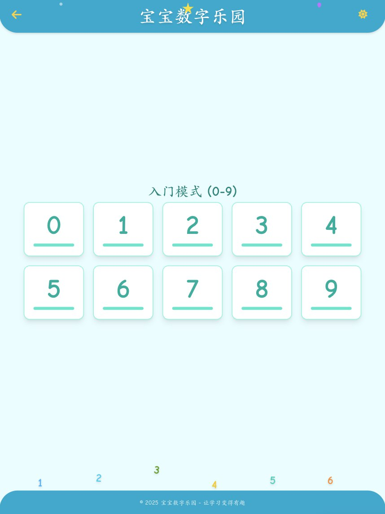
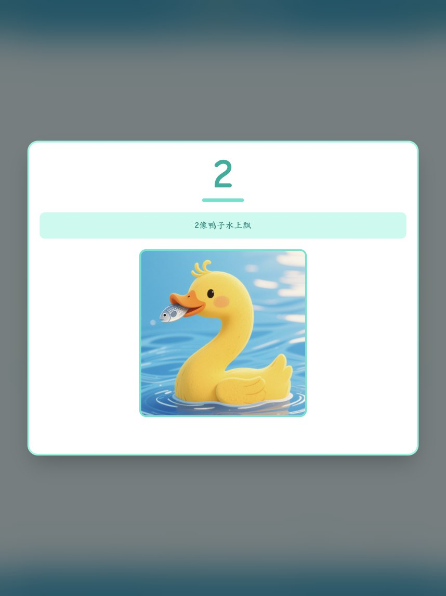
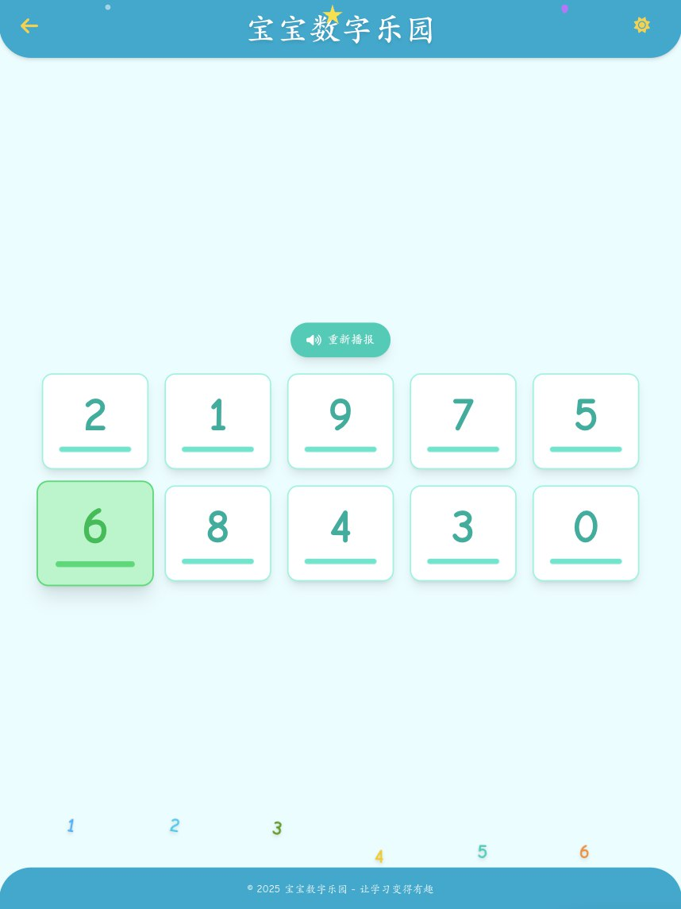
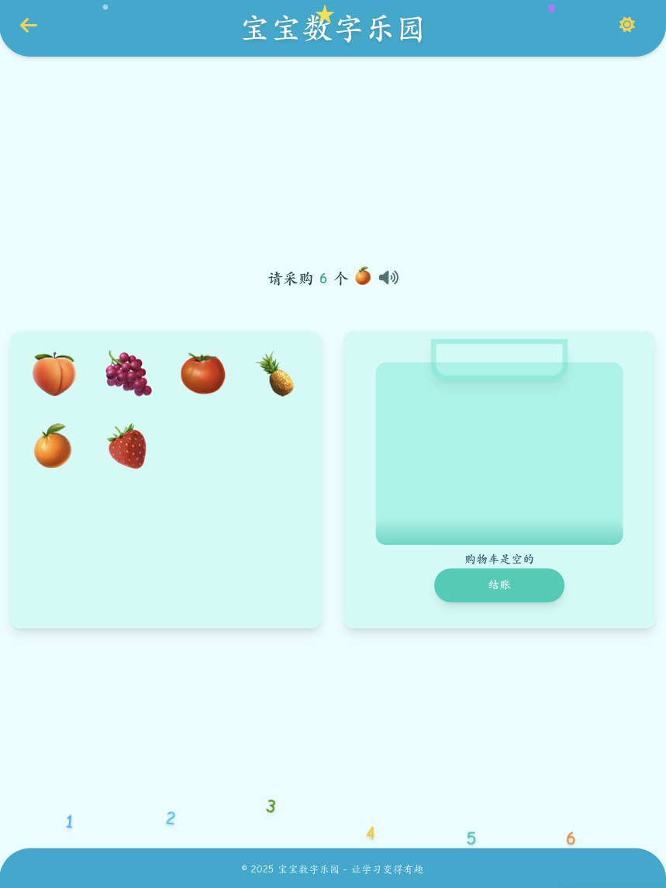

# 宝宝数字乐园

本项目为使用Angular开发的一款，用于宝宝学习数字的应用。

主要功能包括：

- 数字学习：点击对应的数字会播报数字读音，同时会显示对应的数字图片以及说明。

  

  

- 数字听选：系统会随机播报数字，宝宝需要点击选择数字卡片。

  

- 数字泡泡：系统会随机播报数字，宝宝需要在下落的数字泡泡中点击对应数字泡泡。

  

- 数字小火车： 给数字小火车排序，训练宝宝对于数字顺序的理解

  

- 数字超市： 系统给定需要购买的商品的数量，宝宝需要将相应数量的商品放入购物车，增强宝宝对于数字具体数量的理解

  

每个功能都包含对应的入门模式和进阶模式。
入门模式只针对 `0~9` 这10个基本的数字
进阶模式则包含了 `10~99` 这90个数字。

本项目为私人项目，所有用到的图片，以及声音资源，均采用豆包大模型生成。

> 关于移动端：
> 本项目使用 capacitor 进行打包成移动端应用，目前仅支持 Android 平台。
